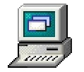
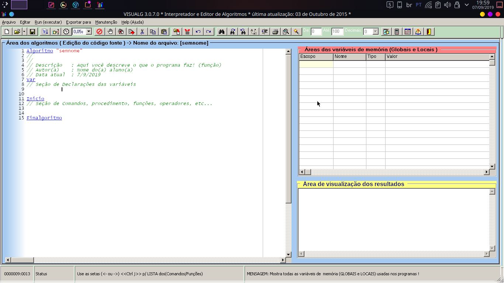
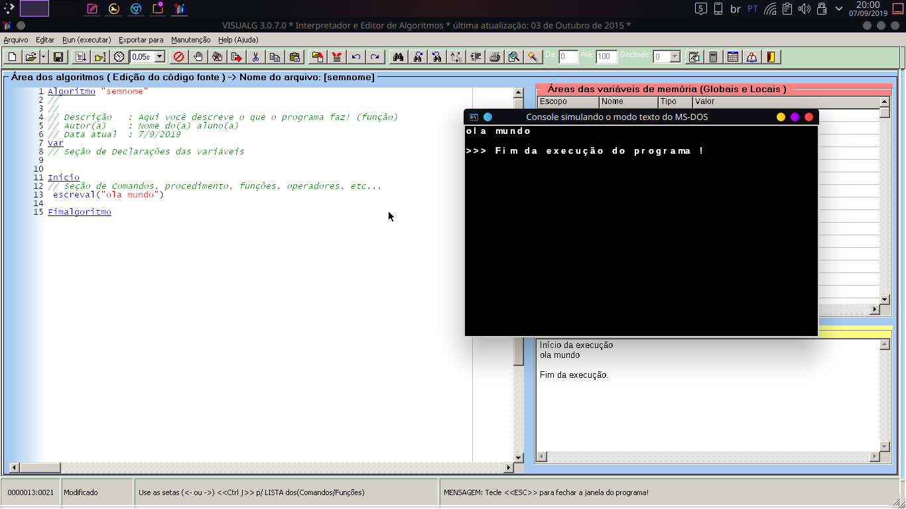

# Creditos:

## VisualG
([O melhor editor e interpretador de Algoritmos é do Brasil](http://visualg3.com.br/))

## Snapcrafters
### notepad-plus-plus
([snap repo for notepad-plus-plus snap](https://github.com/pedroermarinho/notepad-plus-plus))

<h1 align="center">
   
   
   
  
   
  VisualG Wine - O VisualG para Linux
   
   
    
</h1>

## Install
    snap install wine-platform-runtime
    snap install wine-platform-3-stable
    sudo snap install visualg
    snap connect visualg:wine-runtime wine-platform-runtime
    snap connect visualg:wine-3-stable wine-platform-3-stable

([Don't have snapd installed?](https://snapcraft.io/docs/core/install))
 
 
 
([Caso ainda não esteja disponivel na snap store baixe aqui!!!](https://github.com/pedroermarinho/visualg-wine/releases/download/v3.0.7/visualg-wine_3.0.7_amd64.snap))
#### Comando de instalação
## Install
    
    snap install wine-platform-runtime
    snap install wine-platform-3-stable
    sudo snap install --devmode --dangerous visualg-wine_3.0.7_amd64.snap
    snap connect visualg:wine-runtime wine-platform-runtime
    snap connect visualg:wine-3-stable wine-platform-3-stable
    
    
<h1 align="center">
  
</h1>
<h1 align="center">
  
</h1>
